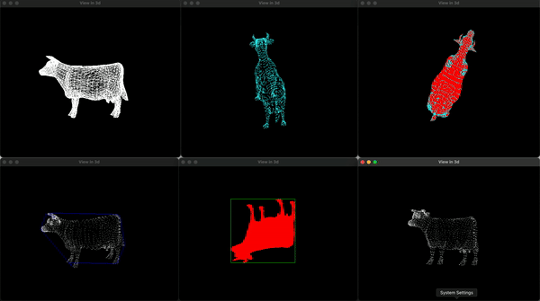
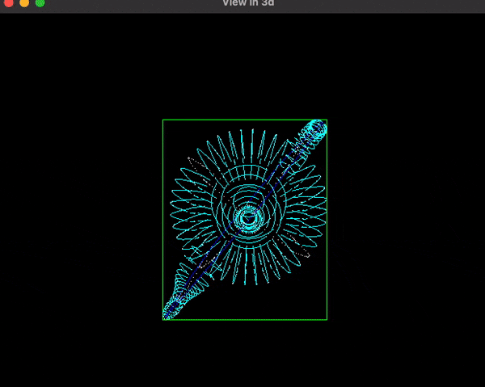
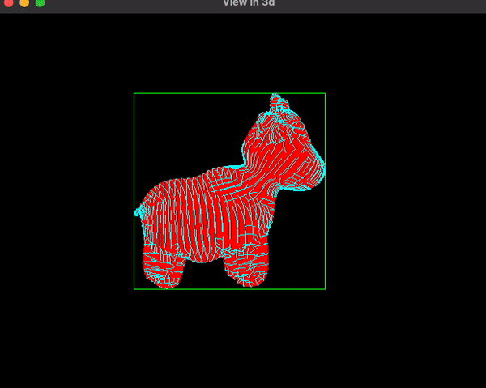

# Model Viewer
 A way to view 3d models but with a few tricks up the sleeve

    
    

    

### Very cool element

Because of how difficult it is to compute the blue design, I use a spatial partitioning KD tree to organize
Here's a rundown:

- start at the root and recursively navigate the tree.
- Ddcide which subtree to explore based on current axis and point distances.

- use a priority queue to track closest points found.
- adjust the queue to keep only the k nearest neighbors.

- rotate vertices based on viewing angles (`angleX` and `angleY`).

### Keyboard Shortcuts for Application Controls

- **Z**: Toggle wireframe mode

- **B**: Toggle visibility of the bounding box in 2d

- **C**: Toggle visibility of the convex hull (i know it's slightly wrong)

- **T**: Toggle point mode which enables purely the points

- **N**: Toggle the blue cool design which is just connecting to the adjacent neighbors without passing through the shape to make a cool blue wireframe-like design

- **Y**: Toggle spin along the X-axis to make it spin (added for the gif)
- 
- **X**: Toggle spin along the Y-axis to make it spin (added for the gif)

